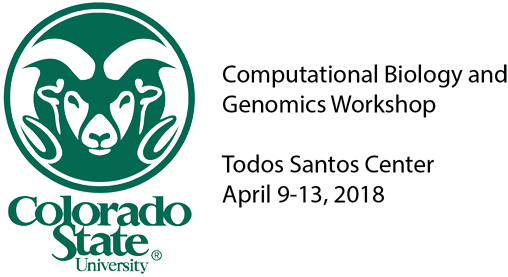

Exercises created by Mark Stenglein for the Genomics and Bioinformatics workshop in 2018 at the CSU Center in Todos Santos, Mexico

- [Mapping and Assembly exercise](./mapping_assembly_exercise.md)
- [Variant calling exercise](./variant_exercise.md)
- [Kim Hoke's mothurexercise](./mothur2018.Rmd)
- [mothur_commands](./Commands_mothur_all)

