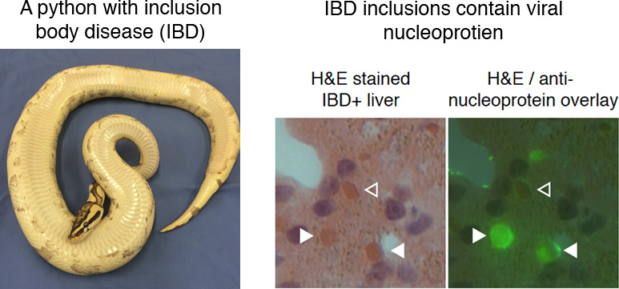
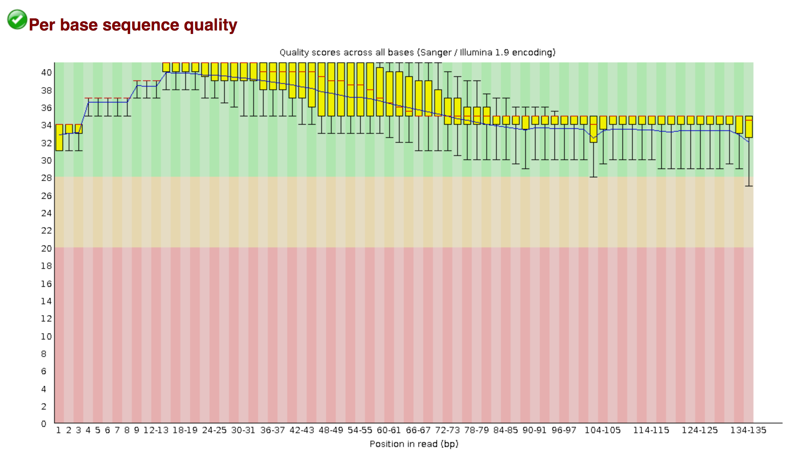
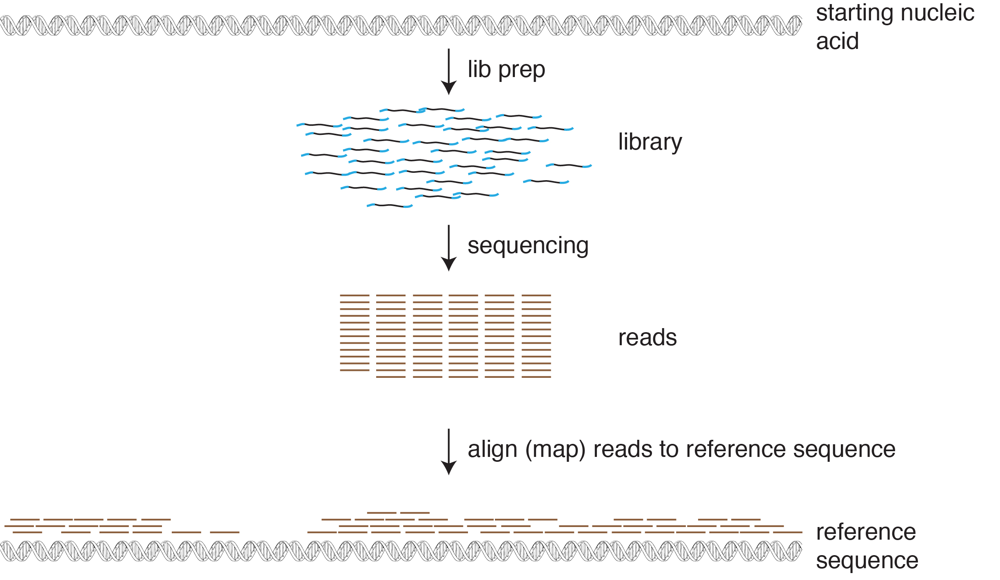

# Mapping and Assembly Exercise
---

## In this exercise, we will download, process, and evaluate NGS datasets and genome sequences.  We will:

* Download a dataset from the SRA
* Use the FASTQC tool to assess the quality of the reads in the dataset
* Trim low quality bases and adapter sequences from reads
* Find and download genome sequences and associated annotation from NCBI
* Map reads from a dataset to a reference genome
* Perform de novo assembly (on Wednesday)

---

### Downloading an SRA dataset

First, we will download publicly available datasets and sequences to work with.  

We will download one of the NGS datasets reported in [this paper](http://journals.plos.org/plospathogens/article?id=10.1371/journal.ppat.1004900)

This dataset was generated by performing shotgun sequencing of total RNA from the liver of a boa constrictor that was diagnosed with [inclusion body disease](https://en.wikipedia.org/wiki/Inclusion_body_disease). The dataset is composed of reads from host RNAs and from viral RNAs.  



We need to determine the accession number of the dataset we want to download:

To get the dataset, open a browser and navigate to the pubmed page for the dataset's paper:

https://www.ncbi.nlm.nih.gov/pubmed/25993603

Scroll down and find the 'Related information' section of the bottom right of the page.  Click on the SRA link.  This shows the SRA datasets associated with this paper.  Search for `snake_7`.  Note that the reads in this dataset are already trimmed.  Note at the bottom of the page the run # (SRR #) for this dataset: SRR1984309


We're going to download this dataset using the command line tool fastq-dump, part of the [SRA toolkit](https://trace.ncbi.nlm.nih.gov/Traces/sra/sra.cgi?view=toolkit_doc).  First, let's create a directory (folder) in which to work.  Open the terminal app on your laptop and type these commands:

Login (ssh) to the cctsi-104 server, if not already logged in:

change (move) to your home directory, if not already there
```
cd
```

make a new directory
```
mkdir ts_working
```

move to that directory
```
cd ts_working
```

confirm that you are in the directory you think you are:
```
pwd
```

We will download the dataset using the fastq-dump tool, part of the [SRA toolkit](https://trace.ncbi.nlm.nih.gov/Traces/sra/sra.cgi?view=toolkit_doc). 

To run fasta-dump, you just need to specify the run # (the SRR#) of the dataset you want.  Recall that our run # is SRR1984309. The --split-files option of the command will create 2, synchronized files for the paired reads

```
fastq-dump SRR1984309 --split-files
```

Confirm that you downloaded the files.  You should see files named SRR1984309_1.fastq and SRR1984309_2.fastq that are each 44 Mb.

```
ls -lh
```

Have a look at the first 20 lines of the fastq files using the head command
```
head -20 SRR1984309_1.fastq SRR1984309_2.fastq
```

- What is on each of the 4-lines that make up each sequence?  (See: [FASTQ format](https://en.wikipedia.org/wiki/FASTQ_format))  
- The quality scores for this dataset are in Illumina 1.9 format.  What is the maximum quality score for each basecall?  How does that relate to the estimated probability that a basecall is wrong?
- How many reads are in each file?  There are several ways you can do this:
 - the `wc -l name_of_file` command will tell you the number of lines in the file
 - you could use the grep command with output piped to wc to count the # of lines that begin with @SRR: `grep @SRR SRR1984309_1.fastq | wc -l`

---


### Using FastQC to evaluate quality of NGS data



[FastQC](https://www.bioinformatics.babraham.ac.uk/projects/fastqc/) is a tool that: 

> ... aims to provide a simple way to do some quality control checks on raw sequence data coming from high throughput sequencing pipelines. It provides a modular set of analyses which you can use to give a quick impression of whether your data has any problems of which you should be aware before doing any further analysis

Performing a quality check like this of your data is one of the first things you'll want to do when you receive your new sequencing data (or when you download a dataset from an online repository like the SRA).

Run fastqc as follows:
```
fastqc SRR1984309_1.fastq SRR1984309_2.fastq
```

This command generates 2 html output files which you can see using `ls`: `SRR1984309_1_fastqc.html` and `SRR1984309_2_fastqc.html`

Copies of these files have been put online at: [SRR1984309_1_fastqc.html](http://htmlpreview.github.com/?https://github.com/stenglein-lab/2018_Todos_Santos/blob/master/results/SRR1984309_1_fastqc.html) and [SRR1984309_2_fastqc.html](http://htmlpreview.github.com/?https://github.com/stenglein-lab/2018_Todos_Santos/blob/master/results/SRR1984309_2_fastqc.html)).  Click on those links in a browser and have a look at the fastqc results.  

These datasets have already been pre-cleaned prior to SRA upload, so they look pretty good.  Note that there is possible Nextera adapter contamination towards the end of some reads.  This makes sense, because the libraries were made with the Nextera protocol.  In the next section, we will trim those off.

---

### Read trimming with cutadapt

Often, NGS reads contain adapters sequences.  This happens when the library molecules are too short, and the sequence reads go all the way through the insert (the part of the library molecule derived from the sample) and into the opposite adapter.


[cutadapt](http://cutadapt.readthedocs.io/en/stable/guide.html) is a tool that can be used to trim low quality and adapter sequences from NGS reads.  It's always a good idea to trim raw NGS reads as a first analysis step.

cutadapt has a lot of options, described [here](http://cutadapt.readthedocs.io/en/stable/guide.html) 

We will run this command to trim our reads:
```
cutadapt -b AGATGTGTATAAGAGACAG -B AGATGTGTATAAGAGACAG -b CTGTCTCTTATACACATCT -B CTGTCTCTTATACACATCT -q 30,30 --minimum-length 80 -o SRR1984309_1_trimmed.fastq -p SRR1984309_2_trimmed.fastq SRR1984309_1.fastq SRR1984309_2.fastq
``` 

What do all these options mean?
```
 cutadapt \ 
 -b AGATGTGTATAAGAGACAG -B AGATGTGTATAAGAGACAG \ 
 -b CTGTCTCTTATACACATCT -B CTGTCTCTTATACACATCT \  # trim Nextera adapters
 -q 30,30 \                                       # trim low quality bases (basecall quality < 30)
 --minimum-length 80 \                            # remove reads shorter than 80 and their pairs
 -o SRR1984309_1_trimmed.fastq \                  # trimmed (read 1) output
 -p SRR1984309_2_trimmed.fastq \                  # paired read (read 2) trimmed output
 SRR1984309_1.fastq SRR1984309_2.fastq            # input files  
```

You will see some output describing a summary of what cutadapt did that should look something like this: 

```

This is cutadapt 1.14 with Python 2.7.12
Command line parameters: -b AGATGTGTATAAGAGACAG -B AGATGTGTATAAGAGACAG -b CTGTCTCTTATACACATCT -B CTGTCTCTTATACACATCT -q 30,30 --minimum-length 80 -u 1 -o SRR1984309_1_trimmed.fastq -p SRR1984309_2_trimmed.fastq SRR1984309_1.fastq SRR1984309_2.fastq
Trimming 4 adapters with at most 10.0% errors in paired-end mode ...
Finished in 10.84 s (75 us/read; 0.80 M reads/minute).

=== Summary ===

Total read pairs processed:            144,652
  Read 1 with adapter:                  27,916 (19.3%)
  Read 2 with adapter:                  23,814 (16.5%)
Pairs that were too short:              21,538 (14.9%)
Pairs written (passing filters):       123,114 (85.1%)

Total basepairs processed:    35,772,475 bp
  Read 1:    17,915,259 bp
  Read 2:    17,857,216 bp
Quality-trimmed:                 981,418 bp (2.7%)
  Read 1:       502,667 bp
  Read 2:       478,751 bp
Total written (filtered):     30,830,607 bp (86.2%)
  Read 1:    15,370,927 bp

```

Now check to see that the trimmed files exist in your directory:

```
ls -lh
```

Let's re-run run fastqc on the files to see what effect trimming had:
```
fastqc SRR1984309_1_trimmed.fastq SRR1984309_2_trimmed.fastq
```

This again produces html files.  Use cyberduck or sftp to download these html files to your laptop and open them in a browser to have a look at the fastqc results.  Consider these questions:

- Did the quality of the basecalls improve?
- Did the trimming remove Nextera adapters?


---

### Downloading the boa constrictor (mitochondrial) genome.

The dataset we downloaded was created by sequencing a library made from boa constrictor liver RNA.  We will map the reads in this dataset to the boa constrictor genome sequence to demonstrate read mapping in the following exercise.

First, we need to *find* the boa constrictor genome.  As usual, there are several ways we could go about this:

1. navigate through the NCBI [Taxonomy database](https://www.ncbi.nlm.nih.gov/taxonomy/)
2. navigate through the NCBI [Genome database](https://www.ncbi.nlm.nih.gov/genome/)
3. navigate through another genome database, like [Ensembl](http://www.ensembl.org/index.html) or [UCSC](https://genome.ucsc.edu/) 
4. google 'boa constrictor genome sequence'  (not a terrible way to do it)

- Let's choose option 1, and go through the NCBI Taxonomy database.  Navigate to https://www.ncbi.nlm.nih.gov/taxonomy/
   - Search for `boa constrictor`.  
   - Click on Boa constrictor link, then click the Boa constrictor link again
   - You should see a table in the upper right corner showing linked records in various NCBI (Entrez) databases.
   - Click on the `Genome (1)` link in that table to go to the boa constrictor records in the NCBI Genome database 

   - The linked page should say 'No items found', because the boa constrictor genome isn't actually in the NCBI Genome database<sup>[1](#myfootnote1)</sup>.  However, there is a mitochondrial genome. Let's download that.
   - Click on "See also 1 organelle- and plasmid-only records matching your search"
   - In the Replicon Info table, note the link to the boa constrictor mtDNA genome sequence (NC_007398.1)
   - Click on this 'NC_007398.1' RefSeq link

Now we need to download the sequence.  We'll do this through the browser.  In the upper right hand corner of the page, note the 'Send' drop down 

- Click Send To->Complete Record->File->Format->FASTA->Create File

You should have downloaded a fasta file of ~19 kb, named sequence.fasta, or something like that.  

Now download the sequence in GenBank format too.  Note that this file is larger (~42 kb), because it contains annotation as well as the actual sequence.

Use a text editor (WordPad on windows, TextEdit on Mac, TextWranger, etc.) to inspect the files you've just downloaded.  Note that the fasta file does not have any annotation, but the genbank file does.  As we will see, both of these formats will be useful.

Use cyberduck to transfer these files to the server and move them to the ts_working directory.  

We will use these files in the next steps.

You can use the cat (or less) commands to output the contents of these files on the server:
```
# make sure you are in the appropriate directory and copy the files over
cd ~/ts_working

cat NC_007398.fasta
cat NC_007398.gb

# less allows you to page through files
less NC_007398.fasta
less NC_007398.gb
```

Hint: In less: press `space` to advance a page and `q` to exit


## Read Mapping


### Now we will learn how to map reads to a reference sequence.  Read mapping is fundamental to a variety of analyses, including RNA-Seq, SNP identification (variant calling), CHIP-Seq, etc.



### Create a bowtie index from the boa constrictor mitochondrial genome sequence

We will map reads in the SRA dataset that we downloaded to the boa constrictor mitochondrial genome that we downloaded.

Read mapping tools map reads very quickly using pre-built indexes of the reference sequence(s) to which reads will be mapped.  We'll use the [Bowtie2](http://www.nature.com/nmeth/journal/v9/n4/full/nmeth.1923.html) mapper. Bowtie2 has a nice [manual](http://bowtie-bio.sourceforge.net/bowtie2/manual.shtml) that explains how to use this software. 

Note that there are a variety of other good read mapping tools, such as [bwa](http://bio-bwa.sourceforge.net/), [HiSat](https://ccb.jhu.edu/software/hisat2/index.shtml), [gmap/gsnap](http://research-pub.gene.com/gmap/), and [STAR](https://github.com/alexdobin/STAR).

The first step will be to create an index of our reference sequence (the boa constrictor mitochondrial genome).

In your terminal window:

Make sure you are in the right directory (our working directory):
```
pwd
cd ~/ts_working   # if necessary
```

Now confirm that the boa constrictor mtDNA sequence file is there and in FASTA format: 
```
ls -lh    # should see: NC_007398.fasta
```

Now, we'll use the bowtie2-build indexing program to create the index.  This command takes 2 arguments: 
(1) the name of the fasta file containing the sequence(s) you will index
(2) the name of the index (can be whatever you want)

```
bowtie2-build NC_007398.fasta NC_007398_bt_index 
```

Confirm that you built the index.  You should see six files with names ending in bt2, like NC_007398_bt_index.3.bt2
```
ls -lh
```

Note that this index building went very fast for a small genome like the boa mtDNA, but can take much longer (hours) for Gb-sized genomes.


### Mapping reads in the SRA dataset to the boa constrictor mitochondrial genome 

Now that we've created the index, we can map reads to the boa mtDNA.  We'll map our trimmed paired reads to this sequence, as follows:

```
bowtie2 -x NC_007398_bt_index \
   -q -1 SRR1984309_1_trimmed.fastq  -2 SRR1984309_2_trimmed.fastq \
   --no-unal --threads 4 -S SRR1984309_mapped_to_NC_007398.sam
```

Let's deconstruct this command line: 

Option | Meaning
--- | --- 
-x NC_007398_bt_index   |  -x: name of index you created with bowtie2-build
-q   | -q: the reads are in FASTQ format
-1 SRR1984309_1_trimmed.fastq   | name of the paired-read FASTQ file 1
-2 SRR1984309_2_trimmed.fastq   | name of the paired-read FASTQ file 2
--no-unal   | don't output unmapped reads to the SAM output file (will make it _much_ smaller
--threads 4   | since our computers have multiple processers, run on 4 processors to go faster
-S SRR1984309_mapped_to_NC_007398.sam   | name of output file in SAM format


Bowtie will output some information about what percentage of the reads aligned.  
 - What percentage of the reads aligned to the boa constrictor mitochondrial genome?  
 - Does that number make sense?

The main output file from bowtie (and other read mappers) is a file in [sam format](https://en.wikipedia.org/wiki/SAM_(file_format)), which describes how reads aligned to the reference sequence.  The output file from our command is `SRR1984309_mapped_to_NC_007398.sam` 

Sam is a plain text format, so you can look at the first 20 lines by running this command:


```
head -20 SRR1984309_mapped_to_NC_007398.sam      
```

You can see that there are several header lines beginning with `@`, and then one line for each mapped read.  See [here](http://genome.sph.umich.edu/wiki/SAM) or [here](https://samtools.github.io/hts-specs/SAMv1.pdf) for more information about interpreting SAM files.


### Visualizing aligned (mapped) reads in Tablet

We will use [Tablet](https://ics.hutton.ac.uk/tablet/) to visualize the reads we mapped to the boa constrictor mitochondrial genome.

Other tools for visualizing this kind of data include [Geneious](https://www.geneious.com/) and [IGV](http://software.broadinstitute.org/software/igv/)

First, we need to transfer the .sam file from the server to your desktop.  You can do this using Cyberduck. 

It is also possible to transfer files from the command line if you are using a Mac computer or if your Windows computer has a command line interface tht supports sftp.

**Alternative, command line way to transfer files using the command line and sftp:**
``` 
# run this from the command line on your laptop: 
sftp <your_username>@cctsi-104.cvmbs.colostate.edu

# enter your password when prompted

# ftp does not give you a fully functional command line environment, but you can use the cd and ls commands
cd ts_working
ls

# get downloads a file from the server to which you've connected with sftp
get SRR1984309_mapped_to_NC_007398.sam

```

Open tablet:  
- Click 'Open Assembly'.  
  - For the Primary assembly file, use the .sam file you just downloaded.   
  - For the Reference/consensus file, use the fasta formatted file for NC_007398 that you downloaded from Genbank.  (Also here: [NC_007398.fasta](https://raw.githubusercontent.com/stenglein-lab/2018_Todos_Santos/master/exercises/NC_007398.fasta) )

- Click 'Open Features'.  Open the .gff3 file you downloaded from Genbank earlier.  (Also here: [NC_007398.gff3](https://raw.githubusercontent.com/stenglein-lab/2018_Todos_Santos/master/exercises/NC_007398.gff3) )

Some questions to consider when viewing the alignment:
 - Is the coverage even across the mitochondrial genome?  What is the average coverage?  
   - Hint: right click on the read coverage graph at the top of the window and select Coverage Overview
 - This is essentially RNA-Seq data.  Are the mitochondrial genes expressed evenly?  How does this relate to coverage?
 - Are there any variants between this snake's mitochondrial genome sequence and the boa constrictor reference sequence?  Is that expected?
   - Can you distinguish true variants from sequencing errors?
   - Hint: click Color Schemes -> Variants to highlight the variant bases 
 - Can you identify mapped read pairs?  


**We will stop here for today and continue on Wednesday with genome assemblies**

## De novo assembly

We have practiced mapping to a reference sequence.  Imagine that we don't have a reference sequence.  In that case, we'd need to perform de novo assembly.  


**Genome assembly is like doing a jigsaw puzzle when you don't know what the picture looks like.  Image credit: Keith Bradnam, UC Davis**

There are a variety of de novo assemblers with different strengths and weaknesses.  We're going to use the [SPAdes assembler](http://cab.spbu.ru/software/spades/) to assemble the reads in our dataset that don't map to the boa constrictor genome. First, let's map the reads in our dataset to the _entire_ boa constrictor genome, not just the mitochondrial genome.

The instructors have already downloaded an assembly of the boa constrictor genome from [here](http://gigadb.org/dataset/100060) and made a bowtie2 index, which can be found in the TodosSantos directory in your home directories.  We could have you make an index yourself, but that would take a long time (~30 min) for a Gb genome like the boa constrictor's.  The boa constrictor genome index is named boa_constrictor_bt_index.

First, let's move the bowtie index to your working folder:
```
cd ~/ts_working    # in case not in the right directory
mv ../TodosSantos/boa_constrictor_bt_index* .
```

Now, we'll run bowtie2 to map reads to the entire boa genome.  This time we'll run bowtie2 a little differently:
1. We'll run bowtie2 in [local mode](http://bowtie-bio.sourceforge.net/bowtie2/manual.shtml#end-to-end-alignment-versus-local-alignment), which is a more permissive mapping mode that doesn't require the ends of the reads to map
2. We'll keep track of which reads _didn't_ map to the genome using the --un-conc option

```
bowtie2 -x boa_constrictor_bt_index --local \
   -q -1 SRR1984309_1_trimmed.fastq  -2 SRR1984309_2_trimmed.fastq \
   --no-unal --threads 4 -S SRR1984309_mapped_to_boa_genome.sam --un-conc SRR1984309_not_boa_mapped.fastq
```

You should see that ~90% of the reads aligned to the boa constrictor genome sequence (overall alignment rate), leaving ~10% in the files that contain the non-mapping reads: `SRR1984309_not_boa_mapped.1.fastq` and `SRR1984309_not_boa_mapped.2.fastq`

How many non-mapping reads remain in these files?

We will use these non-mapping reads as input to our de novo SPAdes assembly.  Run SPAdes as follows:

```
spades.py   -o SRR1984309_spades_assembly \
   --pe1-1 SRR1984309_not_boa_mapped.1.fastq \
   --pe1-2 SRR1984309_not_boa_mapped.2.fastq \
   -m 12 -t 4
```

Command line options explained:

Option   |Meaning
------   |-------
-o  SRR1984309_spades_assembly |name of directory (folder) where SPAdes output will go
--pe1-1 SRR1984309_not_boa_mapped.1.fastq |name of read1 input file
--pe1-2 SRR1984309_not_boa_mapped.2.fastq |name of read2 input file
-m 12 -t 4 |use 12 Gb of RAM and 4 cores 

SPAdes will output a bunch of status messages to the screen as it runs the assembly.  

After SPAdes finishes, there will be output files in the `SRR1984309_spades_assembly` folder.  Change to that directory and look at the files.  

```
cd SRR1984309_spades_assembly
ls -lh
```

The key Spades output files are:

- contigs.fasta:   the assembled contigs in FASTA format
- scaffolds.fasta: scaffolds in FASTA format
- assembly_graph.fastg:   de bruijn graphs used to create contigs.  Can be visualized using a tool like [Bandage](https://rrwick.github.io/Bandage/)

Let's look at the contigs in contigs.fasta:  

```
less contigs.fasta
```

The contigs are sorted in order of length.  Recall that these are contigs made from the reads that _didn't_ map to the boa constrictor genome. Let's try to figure out what some of the contigs are.

Copy the first 3 contigs (the 3 longest contigs). Here is a command to get the first 3 contigs in non-multiline format:
```
fasta_to_fasta contigs.fasta | head -6 
```

Now, open a browser, navigate to the [NCBI blastn page](https://blast.ncbi.nlm.nih.gov/Blast.cgi?PROGRAM=blastn&PAGE_TYPE=BlastSearch&LINK_LOC=blasthome), and paste the sequences of the first 3 contigs into the search field.  Make sure that the megablast option is selected, and run the BLAST.  

- What are the sequences?  Are you confident in your conclusions?  Do they make sense?


#### Additional, time-permitting exercises 

**1. Coverage and multiplexing calculations:**

You are interested in using NGS to study a collection of related bacterial isolates.  These bacteria have estimated genome sizes of 5 Mbp (5x10<sup>6</sup> bp).  You want to do whole genome sequencing of as many isolates as possible in a single Illumina MiSeq run using paired-end 250 base sequencing (i.e., each of the two paired reads will be 250 bp long).  MiSeq runs generate ~20 million read pairs per paired-end run.  

Questions:

  1. You would like to achieve 100x coverage for each genome.  How many genomes could you multiplex in your MiSeq run?  

  2. Imagine instead that you'll be doing single-end 150 base sequencing instead of paired-end 250 base sequencing.  How many isolates could you multiplex on a single MiSeq run now?


**2. Assembly validation:**

To quote [Miller et al](https://www.ncbi.nlm.nih.gov/pmc/articles/PMC2874646/), the Spades contigs are only "putative reconstructions" of the sequences from which the reads derived.  How could we validate these sequences as being accurate?

One way would be to use another sequencing technology, like PCR and Sanger sequencing.

Another way to validate an assembly is to re-map reads back to it using a mapping tool like bowtie.  This might reveal errors in the assembly, or mis-assemblies.  

If time permits, use what you've learned and re-map reads back to these contigs.  To do this, you'll have to create a new bowtie index (e.g. of the 1st 2 or 3 contigs) using bowtie2-build, then use bowtie2 to map reads.  Then you can visualize the aligned reads in Tablet.  Can you find any problems with the assemblies?


<br>
<br>
<br>
<br>

---
Footnotes

<a name="myfootnote1">1</a>: The boa constrictor genome _was_ sequenced as part of the [Assemblathon 2 competition](https://www.ncbi.nlm.nih.gov/pubmed/23870653), and the (unannotated) assemblies can be found [here](http://gigadb.org/dataset/100060), which you can find by Google searching "boa constrictor genome".  So Google searching is not a bad idea.


