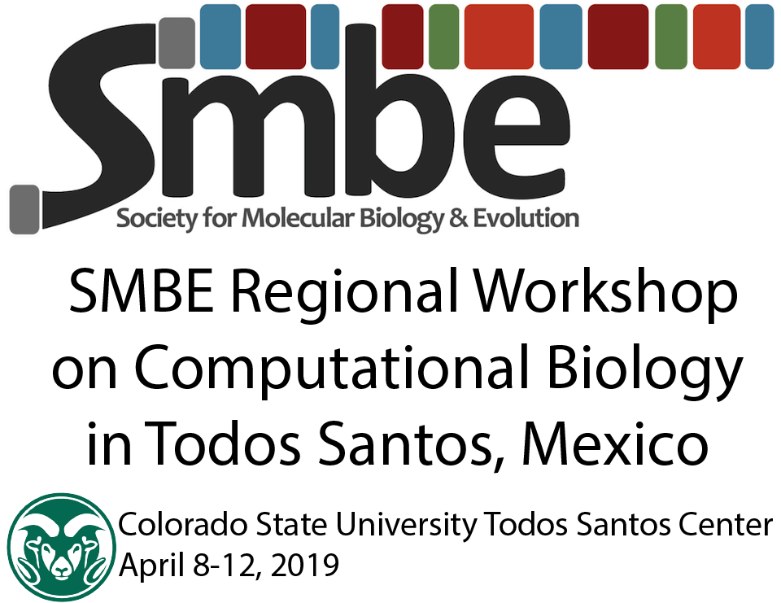

Lectures created by Mark Stenglein for the Genomics and Bioinformatics workshop in 2018 at the CSU Center in Todos Santos, Mexico

- [Intro to genomics and sequencing](./Stenglein_introduction_to_genomics_and_sequencing_lecture.pdf)
- [Database resources](./Stenglein_databases_lecture.pdf)
- [Genome assembly](./Stenglein_de_novo_assembly_lecture.pdf)
- [Metagenomics](./Stenglein_metagenomics_lecture.pdf)
- [Detecting and quantifying variants](./Stenglein_intrahost_variants.pdf)

